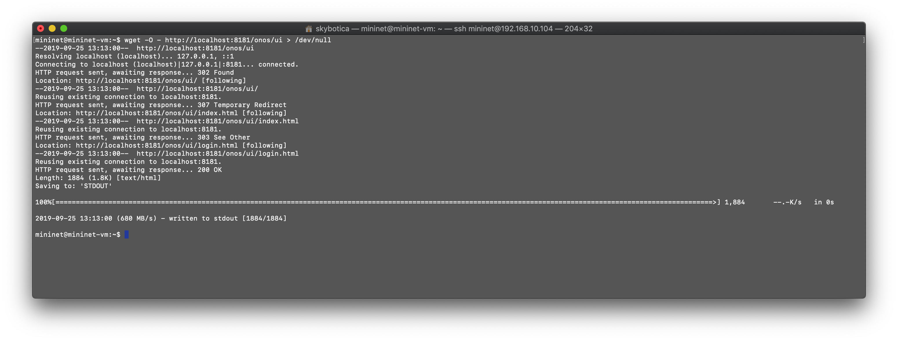
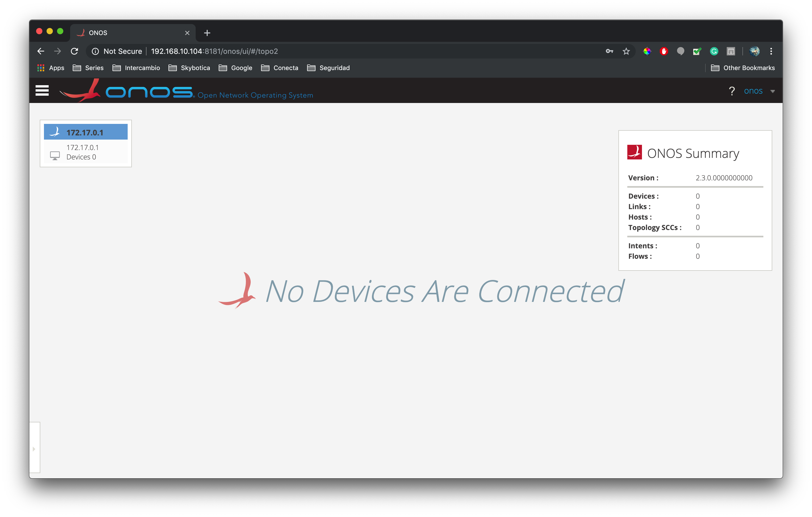

# Install ONOS

## Requirements
- An already configured mininet VM in virtual box
- The mininet VM should have access to internet

## Install Docker
Login to the mininet with a user with super user permissions and run the following commands to install docker.
`sudo apt-get update`
`sudo apt-get -y install docker.io`
`ln -sf /usr/bin/docker.io /usr/local/bin/docker`

## Run Docker image
- Download the onos image using  `sudo docker pull onosproject/onos`.

You can also use an specific release version with :VERSION_NUMBER, e.g. `sudo docker pull onosproject/onos:2.1.0`
- Run a single instance of ONOS
`sudo docker run -t -d -p 8181:8181 -p 8101:8101 -p 5005:5005 -p 830:830 --name onos onosproject/onos`

To run a released version use the :VERSION_NUMBER again, e.g. `sudo docker run -t -d -p 8181:8181 -p 8101:8101 -p 5005:5005 -p 830:830 --name onos onosproject/onos:2.1.0`

- Ensure that the container is up and running `sudo docker ps`, you should see something like:

## Access Onos UI

After running the container the Onos UI should be accessible through the following url http://localhost:8181/onos/ui from mininet. We can check this by running `wget -O - http://localhost:8181/onos/ui > /dev/null`, you should see something like:

However this is from the mininet terminal to see it on our browser we should access with mininet's IP, to know which IP is configured run `ip addr | grep eth0`. 

In our case it is the IP 192.168.10.104 thus we will access the UI with the this url http://192.168.10.104:8181/onos/ui. From there we will log in to the system, the default username is _onos_ and the password is _rocks_.

From there we will see the dashboard with the current topology of the system.

